# Project Prometheus 🧠

**An intelligent prompt augmentation engine designed to unlock the full potential of any Large Language Model.**

---

## 📖 Overview

The quality of output from Generative AI models (like Gemini, GPT-4o, Claude 3) is fundamentally dependent on the quality of the input prompt. "Project Prometheus" acts as an expert "prompt engineer in your pocket," automatically analyzing a user's initial prompt and enhancing it based on a knowledge base of model-specific best practices.

Our goal is to help users get better, more accurate, and more relevant responses from AI, saving time and reducing frustration.

## ✨ Key Features

- **Intent Analysis:** Identifies the user's core intent and detects missing elements like context, constraints, or desired format.
- **Model-Specific Enhancement:** Applies tailored augmentation strategies based on the selected target model (e.g., Gemini 1.5 Pro).
- **Hybrid AI Core:** Powered by a state-of-the-art **Fine-tuned + RAG** (Retrieval-Augmented Generation) architecture.
- **Extensible Knowledge Base:** The RAG pipeline allows for easy updates to prompting guidelines as new models and techniques emerge.
- **Simple Interface:** Accessible via a clean web UI and a developer-friendly REST API.

## 🏛️ Architecture

Prometheus uses a hybrid approach to combine learned patterns with factual knowledge:

1.  **Retrieval (RAG):** When a user selects a target model, our system retrieves the most relevant prompting guidelines from a specialized **Vector Database**.
2.  **Generation (Fine-tuned LLM):** A fine-tuned open-source LLM takes the user's raw prompt and the retrieved guidelines, then synthesizes them to generate an expertly crafted, enhanced prompt.

```mermaid
graph TD
    %% Styling for clarity
    style User fill:#dae4ff,stroke:#4a69bd,stroke-width:2px
    style API fill:#d5f5e3,stroke:#1e8449,stroke-width:2px
    style VectorDB fill:#fdebd0,stroke:#d35400,stroke-width:2px
    style LLM fill:#fadbd8,stroke:#c0392b,stroke-width:2px

    %% Defining the flow
    User(👤 User) -- "1. Submits `raw_prompt` & `target_model`" --> API(🌐 Web App / API)
    
    subgraph "Backend System"
        API -- "2. Sends `target_model` to Retriever" --> Retriever(🔍 RAG Retriever)
        Retriever -- "3. Queries for guidelines" --> VectorDB[(📚 Vector Database<br>Knowledge Base)]
        VectorDB -- "4. Returns relevant 'context'" --> Retriever
        
        Retriever -- "5. Sends 'context' to model" --> LLM(🧠 Fine-tuned LLM)
        API -- "6. Sends `raw_prompt` to model" --> LLM
    end

    LLM -- "7. Generates `enhanced_prompt`" --> API
    API -- "8. Returns result to User" --> User
```

Click to view System Workflow Diagram

## Project layout

- **backend/** — FastAPI prototype, exposes `/augment` endpoint
- **frontend/** — Vite + React static UI prototype
- **docker-compose.yml** — Compose setup for frontend + backend