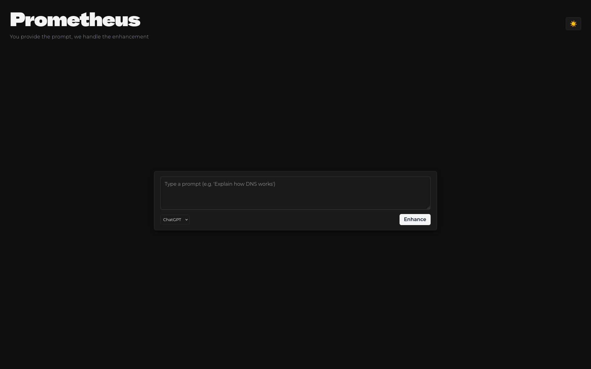

# Project Prometheus - Progress Log 📜

*This log tracks our weekly progress. Newest week's summary is always on top.*

---

## 📌 Week 01 (October 13 & October 14, 2025)

### Day 01
* **Key Accomplishments:** 
    - Frontend: scaffolded React app and components; created frontend/src/App.jsx, frontend/src/main.jsx, frontend/index.html; verified Vite dev server.
    - Backend: implemented FastAPI scaffold and POST /augment stub; added backend/Dockerfile and backend/requirements.txt; defined AugmentRequest/AugmentResponse.
    - Ingest/RAG: added services/ingest/ingest.py and README; drafted ingest plan and metadata schema; researched Chroma/FAISS/Pinecone trade-offs.
    - Research & Prompt Engineering: collected official model docs and vendor guides; summarized prompt-engineering fundamentals and example transformations; produced seed guidelines for fine-tuning and RAG content.
    - Dev tooling: wired docker-compose.yml and added .vscode/tasks.json to run frontend + backend locally.
* **Goals for Next Day:** 
  - [ ] Implement a retriever stub in backend to return top KB passages for a given target_model.
  - [x] Wire a hosted LLM API call (environment-configurable) into the augment flow for MVP generation.
  - [ ] Run the ingestion script on initial seed documents and index vectors locally (Chroma/FAISS prototype).
  - [x] Enhance frontend: connect model-selection to API, display retrieved context, and add thumbs up/down feedback UI.
  - [ ] Add basic unit/smoke tests and a short CI/dev README; verify end-to-end with docker-compose.

### Team Contributions
* **Jero** :
  - Implemented frontend scaffold tasks and components.
  - Created/updated files: frontend/src/App.jsx, frontend/src/main.jsx, frontend/index.html.
  - Verified dev server build locally with Vite; documented startup steps.
  - Notes: focused on UX skeleton and model-selection UI placeholder.

* **Kabe** :
  - Implemented backend scaffold and API stub.
  - Created/updated files: backend/app/main.py (POST /augment stub), backend/Dockerfile, backend/requirements.txt.
  - Performed preliminary prompt-engineering study: summarized fundamentals, best practices, and example transformations.
  - Notes: added API contract (AugmentRequest/AugmentResponse) and basic validation.

* **Bala** :
  - Set up ingestion & RAG placeholders and documentation.
  - Created/updated files: services/ingest/ingest.py, services/ingest/README.md, docs/templates/arch_diagram.md.
  - Researched vector DB options (Chroma, FAISS, Pinecone) and documented trade-offs.
  - Notes: prepared sample ingest plan and metadata schema for KB.

* **Junjar** :
  - Collected official model & prompting documentation and performed initial research.
  - Assembled sources: vendor docs, blogs, and academic references; added links to docs/Project Document.md notes.
  - Notes: produced a short guideline to be used for initial fine-tuning dataset and RAG seed content.
  - Wired docker-compose.yml to expose backend service and added .vscode task for compose up.

---
### Day 02
* **Key Accomplishments:** 
  - Frontend: built minimal UI with dark/light theme toggle; created React components (PromptBar, Results, ResultCard); added custom fonts (BBH Sans Hegarty, Montserrat) and 3D textarea effects; updated models to ChatGPT, Gemini, Claude.
  - Development: set up Python venv and Node.js environment; created mock backend for standalone frontend development; configured Vite dev server with CORS support.
  - Documentation: created .github/copilot-instructions.md for AI agent guidance with quick-start commands and project conventions.
  - Knowledge Base: collected prompting guides for ChatGPT, Gemini, and Claude to support future RAG implementation.

* **Goals for Next Week:** 
  - [ ] Refine the scraping script to clean raw text and remove HTML artifacts.
  - [ ] Create initial batch (200-300 examples) of fine-tuning dataset in JSONL format.
  - [ ] Implement basic text preprocessing and chunking logic for RAG pipeline.
  - [ ] Complete the backlogs of Week 1

### Team Contributions
* **Jero** :
  - Set up Python venv and Node.js environment.
  - Created mock backend for standalone frontend development.
  - Configured Vite dev server with CORS support.
  - Notes: enabled hot reload workflow for live development.

* **Kabe** :
  - Built minimal UI with dark/light theme toggle.
  - Created React components (PromptBar, Results, ResultCard).
  - Added custom fonts (BBH Sans Hegarty, Montserrat) and 3D textarea effects.
  - Updated models to ChatGPT, Gemini, Claude.
  - Notes: implemented responsive layout and keyboard shortcuts (Enter to submit).

* **Bala** :
  - Collected prompting guides for ChatGPT, Gemini, and Claude.
  - Organized knowledge base content to support future RAG implementation.
  - Notes: gathered official documentation and best practices for each model.

* **Junjar** : 
  - Set up Python venv and Node.js environment.
  - Created mock backend for standalone frontend development.
  - Configured Vite dev server with CORS support.
  - Created .github/copilot-instructions.md for AI agent guidance.
  - Notes: documented quick-start commands and project conventions.
---

Designed UI

